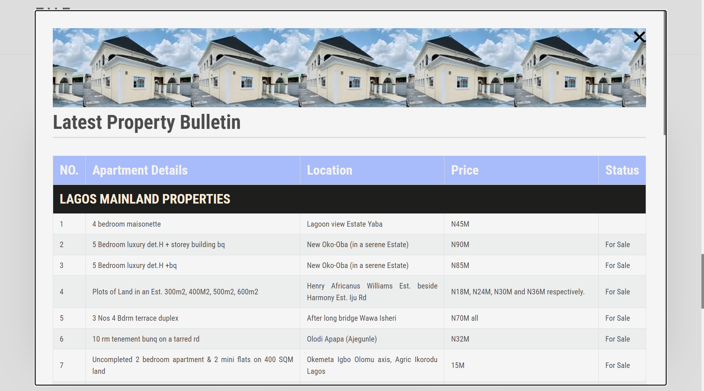
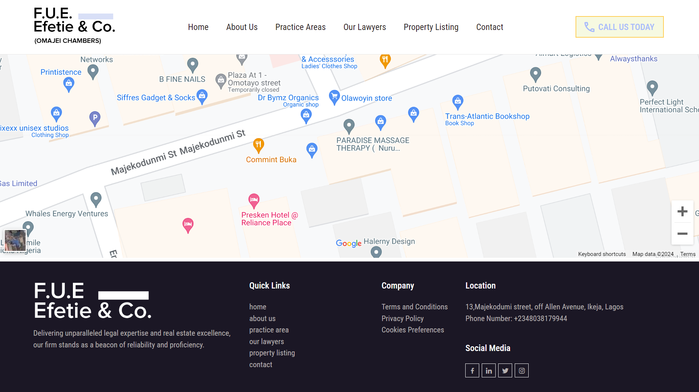

# F.U.E. Efetie & Co. Law Firm and Real Estate Website

Welcome to the official repository for the F.U.E. Efetie & Co. Law Firm and Real Estate website. This website showcases our expertise in corporate law and real estate services, providing a comprehensive online presence for our esteemed clients and visitors.
F.U.E. Efetie & Co. is a leading law firm specializing in corporate law and real estate. Our website serves as a platform to showcase our areas of expertise, connect with clients, and provide valuable resources related to legal matters and real estate transactions.

## Features

- **Homepage:** A welcoming introduction to our firm, featuring a professional design that reflects our commitment to excellence.

- **Services:** Detailed information about our core services in corporate law and real estate, ensuring clients are well-informed about our areas of expertise.

- **Team:** Meet our experienced team of legal professionals and real estate experts. Learn more about their backgrounds and expertise.

- **Contact:** Easily get in touch with us using the contact form or find our physical location on the map. We value communication and strive to provide excellent client support.

## Built With

Ijoko is built using the following technologies:

- **HTML5** - for structuring the web pages.
- **CSS3** - for styling and layout.
- **JavaScript** - for interactive and dynamic features.

[ Live project @ https://fueefetiewlawchamber.netlify.app/](https://fueefetiewlawchamber.netlify.app/)

